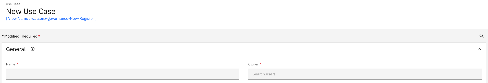
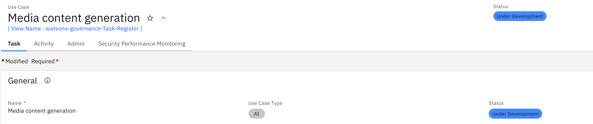
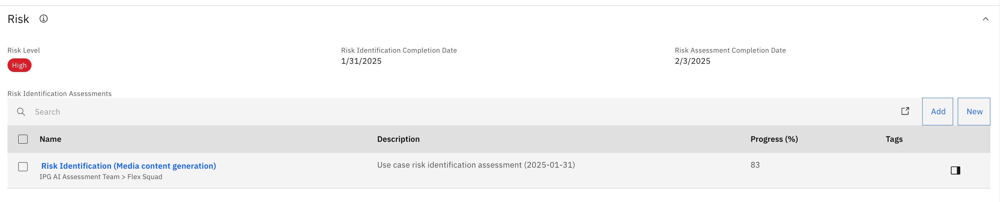
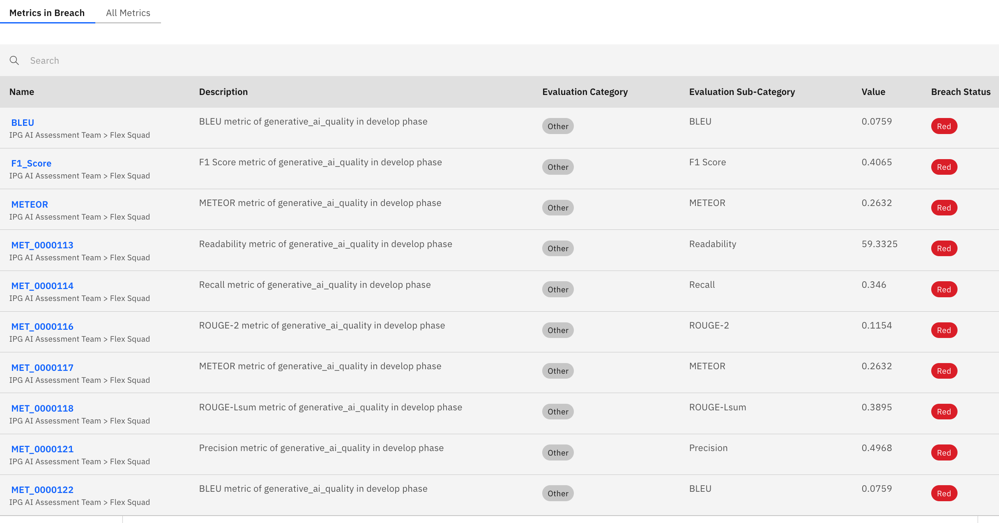
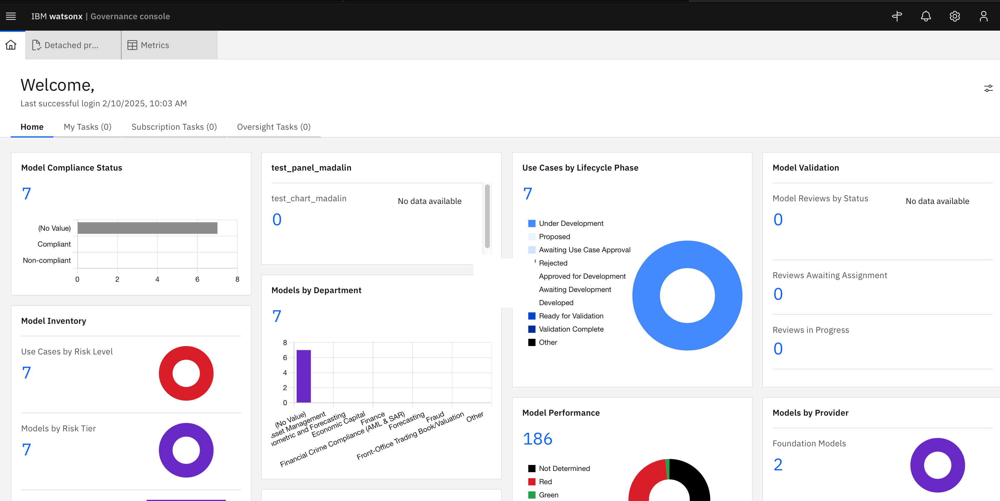

# Brand Voice Content Monitoring

Governing a LLM model hosted on 3rd party using detached prompt templates. These project contains three notebooks, 1. Detached Prompt Template (Default), 2. Detached Prompt Template (PII & HAP), and 3. Detached Prompt Template (Guardrails).

## Structure

[Base Notebook](Detached_Prompt_Template_Creation_CtebnjVOW.ipynb)

[PII & HAP Notebook](Detached_Prompt_Template_Creation_PII_and_HAP_2IJEHYp-M.ipynb)

[Guardrails Notebook](Detached_Prompt_Template_Creation_with_guardrails_TECIn0waB.ipynb)

[Evaluation Data](ipg_llms_input_outputs%20(1).csv)

## Setup

### Credentials

Setup up your credentials in the following cell block in each notebook.

```py
CPD_URL = "<Enter Cloud Pak for Data URL>"
CPD_USERNAME = "<Enter Username>"
CPD_API_KEY = "<Enter Key>"

PROJECT_ID = os.environ.get('PROJECT_ID', "<YOUR_PROJECT_ID>")
print(f"Your project id is '{PROJECT_ID}'")

MODEL_ENDPOINT = "<Enter Model Endpoint>"
MODEL_CLIENT_ID = "<Enter Model Client ID>"
MODEL_CLIENT_SECRET = "<Enter Model Client Secret>"
```

### Running the notebooks 

Run the notebooks after credential edits from Watsonx Projects Window.


### Use Cases in OpenPages

Access OpenPages instance, and create a new Use Case.



Created use case look something like below.



### Risk Assessment

After AI Use Case is created, and approved for proposal the risk assessment can be accessed within the use case, in OpenPages window itself.



The risk is calculated from the filled assessment, and use case is assigned a risk ranging from Low to High.


### Results

Results can be viewed within OpenPages as well as Watsonx Projects window. Here it is how it looks in OpenPages.



Results in watsonx projects folder


Also comparision of results between different prompt practices.


### MRG Dashboard

OpenPages also provides a master dashboard to view and manage use cases. This includes, use cases status, progress, alerts, breaches and performance. Here is a screenshot of a generated dashboard.




