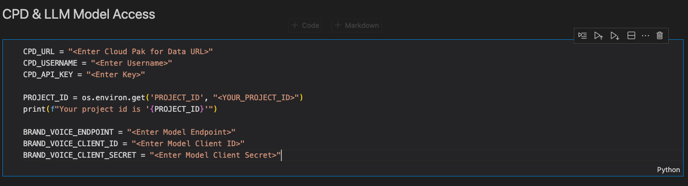

# LLM Content Generation Governance using Watson Governance

Governing a LLM model, for content generation, hosted on 3rd party using detached prompt templates.

These project contains three notebooks, 1. Detached Prompt Template (Default), 2. Detached Prompt Template (PII & HAP), and 3. Detached Prompt Template (Guardrails).

## Structure

[Base Notebook](Detached_Prompt_Template_Creation_CtebnjVOW.ipynb)

[PII & HAP Notebook](Detached_Prompt_Template_Creation_PII_and_HAP_2IJEHYp-M.ipynb)

[Guardrails Notebook](Detached_Prompt_Template_Creation_with_guardrails_TECIn0waB.ipynb)

[Evaluation Data](ipg_llms_input_outputs%20(1).csv)

## Setup

### Credentials

Setup up your credentials in the following cell block in each notebook.

### Running the notebooks 

Run the notebooks after edit, and see the evaluation results.

### Results

Also compare results between different prompt practices.

